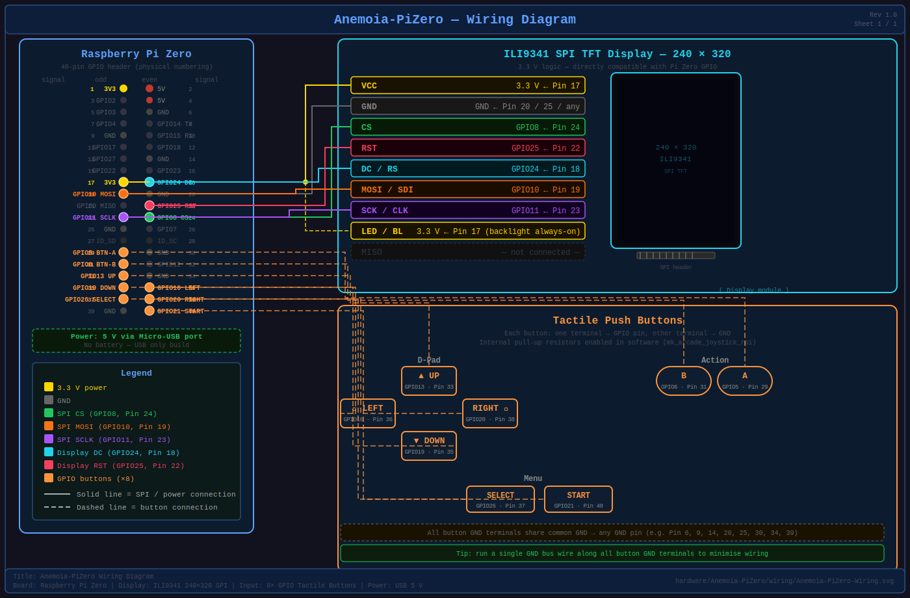

<h1 align="center">
  <br>
  
  <br>
  <b>Anemoia-PiZero</b>
  <br>
</h1>

<p align="center">
  Anemoia-PiZero is a fork of <a href="https://github.com/Shim06/Anemoia-ESP32">Anemoia-ESP32</a>, adapted to run on a <strong>Raspberry Pi Zero</strong> using <strong>RetroPie</strong>.  
  It reuses the original 3D-printed enclosure and tactile button layout, replacing the ESP32 with a Pi Zero and dropping the battery for a USB-powered build.  
  The display is an ILI9341-based SPI TFT (240×320), driven via the Pi's SPI interface.
</p>

---

## Table of Contents

- [Differences from Anemoia-ESP32](#differences-from-anemoia-esp32)
- [Hardware Overview](#hardware-overview)
  - [Parts List](#parts-list)
  - [Wiring](#wiring)
    - [ILI9341 Display](#ili9341-display)
    - [Tactile Buttons](#tactile-buttons)
- [Software Setup](#software-setup)
  - [Step 1 - Install RetroPie](#step-1---install-retropie)
  - [Step 2 - Configure the SPI Display](#step-2---configure-the-spi-display)
  - [Step 3 - Configure GPIO Buttons](#step-3---configure-gpio-buttons)
  - [Step 4 - Add ROMs](#step-4---add-roms)
- [3D Model & Enclosure](#3d-model--enclosure)
- [Contributing](#contributing)
- [License](#license)

---

## Differences from Anemoia-ESP32

| Aspect            | Anemoia-ESP32               | Anemoia-PiZero                        |
|-------------------|-----------------------------|---------------------------------------|
| Board             | ESP32 (dual-core)           | Raspberry Pi Zero (no W)              |
| OS / Runtime      | Arduino / bare metal        | RetroPie (Raspberry Pi OS + RetroArch)|
| Display           | ST7789 or ILI9341 SPI TFT   | ILI9341 SPI TFT (240×320)             |
| Audio             | PAM8403 amplifier + speaker | None (not implemented yet)            |
| ROM storage       | Separate SPI microSD module | ROMs on the main OS SD card           |
| Input             | Various controllers         | 8 tactile push buttons (GPIO)         |
| Power             | Battery + TP4056 charger    | USB power only (no battery)           |
| PCB               | Custom PCB options          | Hand-wired (wires / proto board)      |

---

## Hardware Overview

### Parts List

| Part | Specification | Notes |
|---|---|---|
| Raspberry Pi Zero | Any revision | Pi Zero 2 W gives better emulation performance |
| SPI TFT display | ILI9341, 240×320, 2.8" | Bare module, not a touchscreen variant |
| Tactile push buttons | 12×12mm body | **6mm or 6.5mm stem height** — see note below |
| Proto board | 5×7 cm (50×70mm) | Elegoo or equivalent, 2.54mm pitch |
| MicroSD card | 8GB minimum, Class 10 | For OS + ROMs |
| USB power supply | 5V / 1A via Micro-USB | Standard phone charger works |
| Hookup wire | 28 AWG stranded | ~30cm total; solid core also works inside case |
| M2.5 × 6mm screws | Self-tapping | ×2, to mount proto board to case standoffs |
| Solder, flux | — | Standard 60/40 or lead-free |

> [!WARNING]
> **Button stem height is critical.** The top shell inner cavity is approximately 7mm deep.
> Standard 12×12×7.3mm tactile buttons (the most common size) will be 0.3mm too tall and will
> prevent the case from closing cleanly. Use **12×12×6mm** or **12×12×6.5mm** buttons, or
> carefully sand the stem tips down ~0.5mm before assembly. Test-fit the buttons in the case
> before soldering them to the proto board.

> [!NOTE]
> No audio amplifier or speaker is needed for this build. Audio support may be added in a future revision.

---

### Physical Assembly

#### Overview

The Pi Zero is soldered **directly to the proto board** (no 40-pin header) using short wire
bridges. This keeps the total stack height to ~7.5mm, which fits inside the 13mm bottom cavity
with clearance.

```
Bottom shell cavity (13mm deep)
  └── Proto board (1.6mm)
      └── Wire bridges (2mm)
          └── Pi Zero PCB (1.4mm)
              └── USB Micro-B connectors (2.5mm, bottom edge only)
                                                Total stack: ~7.5mm
```

#### Step 1 — Prepare the proto board

1. Cut the 5×7cm proto board to **65×50mm** if you want a tighter fit, or leave full-size
   (70×50mm) — both fit inside the case footprint (available X = 85→150mm = 65mm, Y = full width).
2. Mark the positions of the two Pi Zero mounting holes on the proto board. The Pi Zero's
   mounting holes are 3.5mm diameter, spaced **58mm × 23mm** centre-to-centre
   (at 3.5mm from each corner of the 65×30mm PCB edge).

#### Step 2 — Mount the Pi Zero to the proto board

1. Lay the Pi Zero face-up on the proto board, aligning the mounting holes.
2. Solder short (~10mm) wire bridges from each of the Pi Zero's 40 GPIO pads to the nearest
   proto board through-holes. You only need to bridge the pins you are actually using
   (see wiring table below) — you do not need to bridge all 40 pins.
3. **Minimum required bridges:**
   - Pin 1 (3.3V) — for display VCC
   - Pin 2 or 4 (5V) — not used in this build, skip
   - All GND pins used (Pin 6, Pin 20, Pin 14 — connect together on proto board)
   - All signal pins from the wiring tables (SPI + GPIO buttons)
4. Use a thin bead of **epoxy or hot glue** along the Pi Zero short edges to mechanically
   bond it to the proto board once you are satisfied with the wiring.

#### Step 3 — Wire the display

Run 28 AWG wires from the ILI9341 module directly to the proto board pads corresponding to
each GPIO pin. Keep wires short — route them flat against the proto board before entering the
case. The display module sits inside the top shell, held in place by the screen window bezel.

> [!TIP]
> Solder the display wires **last**, after the Pi Zero is bonded and all button wires are run.
> The display wires cross the case interior and need to be the correct length to reach the module
> without pulling tight or bunching up.

#### Step 4 — Wire the buttons

Each button has four legs in a 12×12mm square pattern; legs on opposite sides are internally
connected. Solder one leg to a GND rail on the proto board and the diagonal leg to the
corresponding GPIO wire. Buttons sit in the top shell button holes — route wires down through
the parting line gap and to the proto board.

> [!TIP]
> Use a 10cm length of wire per button before trimming. After a test fit inside the case,
> trim to the correct length and re-solder.

#### Step 5 — Seat in the case

1. Place the assembled proto board (Pi Zero face-up) into the **bottom shell**, positioning it
   so the Pi Zero USB PWR and OTG port openings align with the two Micro-USB cutouts on the
   bottom edge of the case.
   - Pi Zero left edge should align with approximately **X = 85mm** from the left end of the case.
2. Secure with **2× M2.5 × 6mm self-tapping screws** through the case floor standoffs into the
   Pi Zero mounting holes. Alternatively, use **3M VHB double-sided tape** under the proto board.
3. Route the ILI9341 module wires up to the top shell, then press-fit the display module into
   the screen window bezel.
4. Snap the top and bottom shells together. The shells are held by friction clips; no screws needed.

---

### Wiring



All connections are hand-wired. The Pi Zero uses 3.3V logic on all GPIO pins, which is directly compatible with the ILI9341 display.

#### ILI9341 Display

The display is connected to the Pi Zero's hardware SPI0 bus.

| ILI9341 Signal | Pi Zero Pin | GPIO  |
|----------------|-------------|-------|
| VCC            | Pin 17      | 3.3V  |
| GND            | Pin 20      | GND   |
| CS             | Pin 24      | GPIO8 (CE0) |
| RESET          | Pin 22      | GPIO25 |
| DC / RS        | Pin 18      | GPIO24 |
| MOSI / SDI     | Pin 19      | GPIO10 (MOSI) |
| SCK / CLK      | Pin 23      | GPIO11 (SCLK) |
| LED / BL       | Pin 17      | 3.3V (always on) |
| MISO           | -           | Not connected |

> [!NOTE]
> The backlight (LED/BL) pin can be connected directly to 3.3V for always-on operation, or to a GPIO pin if you want software brightness control later.

---

#### Tactile Buttons

Each button connects between a GPIO pin and GND. The Pi's internal pull-up resistors are enabled in software.

| NES Button | Pi Zero Pin | GPIO   |
|------------|-------------|--------|
| A          | Pin 29      | GPIO5  |
| B          | Pin 31      | GPIO6  |
| Up         | Pin 33      | GPIO13 |
| Down       | Pin 35      | GPIO19 |
| Left       | Pin 36      | GPIO16 |
| Right      | Pin 38      | GPIO20 |
| Start      | Pin 40      | GPIO21 |
| Select     | Pin 37      | GPIO26 |

> [!NOTE]
> These GPIO assignments are suggestions. You can remap them during the RetroArch controller configuration step. Avoid GPIO2, GPIO3 (I2C), and GPIO14/15 (UART) to prevent conflicts.

---

## Software Setup

### Step 1 - Install RetroPie

1. Download the latest **RetroPie** image for **Raspberry Pi Zero / Zero W** from the [official RetroPie website](https://retropie.org.uk/download/).
2. Flash the image to your microSD card using [Raspberry Pi Imager](https://www.raspberrypi.com/software/) or [balenaEtcher](https://etcher.balena.io/).
3. Insert the SD card into your Pi Zero and boot it up connected to an HDMI monitor first to complete initial setup.

---

### Step 2 - Configure the SPI Display

The ILI9341 display is driven by [`fbcp-ili9341`](https://github.com/juj/fbcp-ili9341) — a userspace SPI display driver that reads `/dev/fb0` (the HDMI virtual framebuffer) and pushes it directly to the ILI9341 over `/dev/spidev0.0`. This requires no kernel module or device tree overlay, and works on all Pi kernel versions.

> [!NOTE]
> The `dtoverlay=fbtft,...` and `fbtft_device` module approaches both fail on the kernel version (`5.10.x`) shipped with current RetroPie for Pi Zero. Use `fbcp-ili9341` instead.

#### 2a — Enable SPI and set the HDMI virtual resolution

Mount the SD card on your PC, or SSH/edit directly on the Pi, and open `/boot/config.txt`. Append the contents of `config/boot_config.txt` from this repo (or copy the lines below):

```
# Enable SPI bus (required for the ILI9341 display)
dtparam=spi=on

# Force HDMI output at 320x240.
# fbcp-ili9341 reads /dev/fb0 and pushes it directly to the ILI9341 over SPI.
# These settings are required even if no HDMI monitor is connected.
hdmi_force_hotplug=1
hdmi_group=2
hdmi_mode=87
hdmi_cvt=320 240 60 1 0 0 0
```

#### 2b — Install fbcp-ili9341

SSH into the Pi and run:

```bash
sudo apt update
sudo apt install -y cmake
git clone https://github.com/juj/fbcp-ili9341.git
cd fbcp-ili9341
mkdir build && cd build
cmake -DILI9341=ON \
      -DSPI_BUS_CLOCK_DIVISOR=6 \
      -DGPIO_TFT_DATA_CONTROL=24 \
      -DGPIO_TFT_RESET_PIN=25 \
      -DDISPLAY_ROTATE_180_DEGREES=ON \
      -DBACKLIGHT_CONTROL=OFF \
      -DSTATISTICS=0 \
      ..
make -j$(nproc)
sudo install fbcp-ili9341 /usr/local/bin/fbcp-ili9341
```

Parameter notes:
- `-DILI9341=ON` — selects the ILI9341 driver
- `-DSPI_BUS_CLOCK_DIVISOR=6` — sets SPI clock to `core_freq / 6` ≈ 66 MHz (safe default; increase divisor if you see corruption)
- `-DGPIO_TFT_DATA_CONTROL=24` — DC pin = GPIO24 (Pin 18)
- `-DGPIO_TFT_RESET_PIN=25` — RESET pin = GPIO25 (Pin 22)
- `-DDISPLAY_ROTATE_180_DEGREES=ON` — landscape orientation; swap for `OFF` if the image is upside-down
- `-DBACKLIGHT_CONTROL=OFF` — backlight is wired directly to 3.3V, not a GPIO
- `-DSTATISTICS=0` — disables on-screen FPS overlay

#### 2c — Test before enabling autostart

Run it manually first to confirm the display works:

```bash
sudo fbcp-ili9341
```

The RetroPie interface should appear on the screen. Press `Ctrl+C` to stop.

#### 2d — Enable autostart at boot

Add to `/etc/rc.local` before `exit 0`:

```bash
/usr/local/bin/fbcp-ili9341 &
```

Reboot. The RetroPie interface should appear on the SPI display on every boot.

> [!TIP]
> If colours look wrong (red/blue swapped), add `-DCOLOR_ORDER_BGR=ON` to the `cmake` command and recompile. If the image is mirrored, swap `-DDISPLAY_ROTATE_180_DEGREES` between `ON` and `OFF`.

---

### Step 3 - Configure GPIO Buttons

RetroPie uses `mk_arcade_joystick_rpi` (or `GPIOnext`) to expose GPIO buttons as a gamepad to RetroArch.

#### Install mk_arcade_joystick_rpi

```bash
# From the RetroPie-Setup script:
# Main Menu → Manage Packages → Manage driver packages → gpio-joystick → Install
```

Or manually:

```bash
git clone https://github.com/recalbox/mk_arcade_joystick_rpi
cd mk_arcade_joystick_rpi
sudo ./install.sh
```

#### Load the module with your GPIO mapping

Map the buttons to the GPIO numbers you wired. The order expected by `mk_arcade_joystick_rpi` is:

`up, down, left, right, start, select, a, b`

Using the pin assignments from the [Tactile Buttons](#tactile-buttons) table above:

```bash
sudo modprobe mk_arcade_joystick_rpi map=1 gpio=13,19,16,20,21,26,5,6
```

To make this permanent, add to `/etc/modules`:

```
mk_arcade_joystick_rpi
```

And create `/etc/modprobe.d/mk_arcade_joystick_rpi.conf`:

```
options mk_arcade_joystick_rpi map=1 gpio=13,19,16,20,21,26,5,6
```

#### Configure RetroArch

On first launch, EmulationStation will prompt you to configure the controller. Press and hold any button to begin, then follow the on-screen mapping.

---

### Step 4 - Add ROMs

1. Copy your legally obtained `.nes` ROM files to the following directory on the SD card:

```
/home/pi/RetroPie/roms/nes/
```

You can do this by:
- Mounting the SD card on your PC and copying files directly, or
- Using a USB drive: create a folder `retropie/roms/nes/` on the USB drive, plug it into the Pi, wait 30 seconds, then copy ROMs to the populated folder.

2. Restart EmulationStation. Your ROMs will appear in the NES game list.

---

## 3D Model & Enclosure

The original enclosure and 3D models from Anemoia-ESP32 are reused unchanged. All files are available in the `/3d-model` folder.

> [!NOTE]
> The Pi Zero has the same compact form factor as the ESP32 DevKit used in the original design. Minor modifications to the PCB mount points may be required depending on your specific Pi Zero revision. The hand-wired approach means no custom PCB is needed.

---

## Contributing

Pull requests are welcome. For major changes, please open an issue first to discuss what you would like to change.

---

## License

This project is licensed under the GNU General Public License v3.0 (GPLv3) - see the [LICENSE](LICENSE) file for more details.

Original Anemoia-ESP32 project by [Shim06](https://github.com/Shim06/Anemoia-ESP32).
